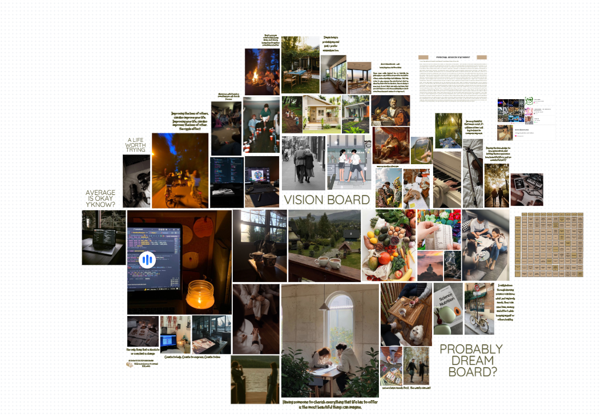
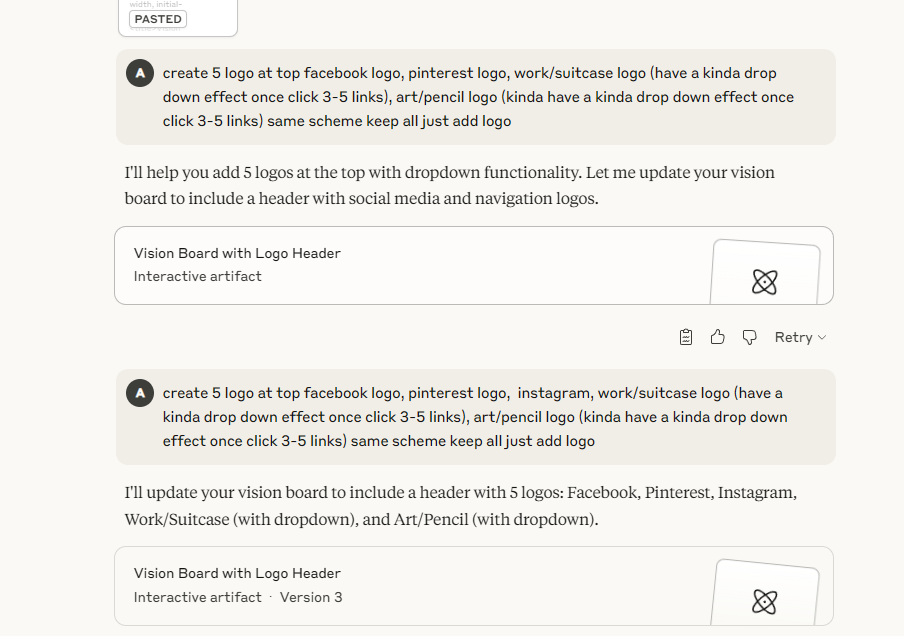
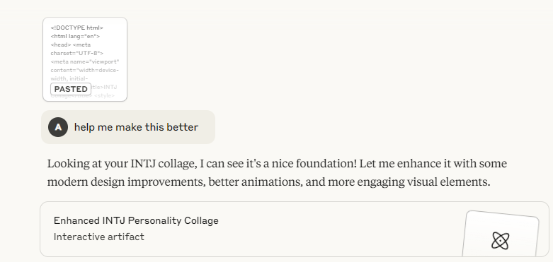
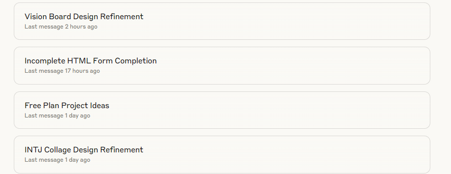

# Vision Board  

> A vision board that highlights my goals in life and what I aspire to be — built through “vibe coding” with the help of AI.  

---

## Table of Contents  
- [About](#about)  
- [Motivation](#motivation)  
- [Tech Stack](#tech-stack)  
- [Process & Thought Flow](#process--thought-flow)  
- [Features](#features)  
- [Usage](#usage)  
- [Challenges & Learnings](#challenges--learnings)  
- [Future Improvements](#future-improvements)  
- [License](#license)  
- [Contact](#contact)  

---

## About  
This project is a personal vision board — a creative way to showcase who I am, what I do, and what inspires me.  
It’s built through a **“vibe coding”** approach: experimenting, iterating, and letting intuition guide the design.  

The goal is twofold:  
1. Share my vision in the most aesthetic way possible.  
2. Consolidate scattered links, projects, and inspirations into one place where people can learn more about me.  

---

## Motivation  
I started this project out of curiosity and self-expression.  

- I wanted a space that best describes *what I do* and *what I’ve experienced*.  
- I was curious how well I could translate my **vision** into code using AI tools like Claude.  
- It’s also a way to explore **prompt engineering** — seeing how far I could push AI in creating something aesthetic and meaningful.  

---

## Tech Stack  
Technologies and tools used in building this:  

- **Languages**: HTML, CSS, JavaScript  
- **Fonts**: Google Fonts API (generated via Claude)  
- **AI Tools**: Claude (for coding & layout), ChatGPT (for snippets & grammar fixes)  
- **Editor**: VS Code  
- **Hosting**: GitHub Pages  

---

## Process & Thought Flow  
This project followed a **“vibe coding”** journey:  

- **Initial idea & experiments**  
   - Started as an INTJ collage to describe my personality.  
   - The first output was dark and edgy — cool, but not the vibe I wanted.  
- **Decisions made**  
   - I referenced an old mood board I made with a soft, clean, monochrome aesthetic.  
   - Prompted Claude with keywords like *sleek, minimal, elegant, aesthetic* to shape the design.  
- **Shortcuts & intuition**  
   - The real shortcut was **prompting well**.  
   - Describing the *feelings* I wanted the user to have when seeing the site made the results better.  
- **Iteration process**  
   - I kept prompting, fixing errors, and refining the look.  
   - Each iteration got closer to the vibe I imagined.  

---

## Visuals  
Here are some snapshots from the journey:  

  
  
  
  

---

## Features  
- A personal vision board site  
- Moodboard-style layout  
- Minimalist & aesthetic design  
- Easy to update with new inspirations  

---

## Usage  
Clone the repo and open `index.html` in your browser:  
